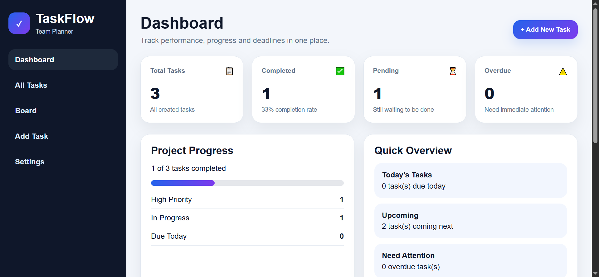

🚀 Task Manager (Vue.js)

A modern task management application built with Vue.js, designed to organize workflows through a clean and intuitive Kanban-style interface.

This project demonstrates practical frontend development skills, including component-based architecture, reactive data handling, and building structured user interfaces.

📸 

🔗 Live Demo: https://hasan1303.github.io/task-dashboard/#/

✨ Features
➕ Create and delete tasks
📋 Organize tasks into columns (To Do, In Progress, Done)
⚡ Dynamic UI updates using Vue reactivity
🎯 Clean and minimal design focused on usability
📱 Responsive layout
🛠️ Tech Stack
🟢 Vue.js
⚙️ JavaScript (ES6+)
🎨 HTML5 & CSS3
🚀 Getting Started
git clone https://github.com/your-username/task-manager.git

Open the project folder and run:

👉 Open index.html in your browser

📂 Project Structure

## 📂 Project Structure

```bash
task-manager/
├── index.html        # Main entry file
├── app.js            # Application logic (Vue)
├── style.css         # Styling
├── preview.png       # Project preview image
└── README.md
```
## 🧠 Project Highlights

- Built using core Vue.js concepts in a real project scenario  
- Component-based architecture for better scalability  
- Focus on clean UI and maintainable code  
- Hands-on implementation of reactive data handling  

## 🔮 Future Improvements

- 🧲 Drag & drop functionality  
- 📦 Improved state management  
- ☁️ Backend integration (API / Firebase)  

## 👨‍💻 Author

Hasan Pisli  
Frontend Developer (Vue.js / WordPress)
